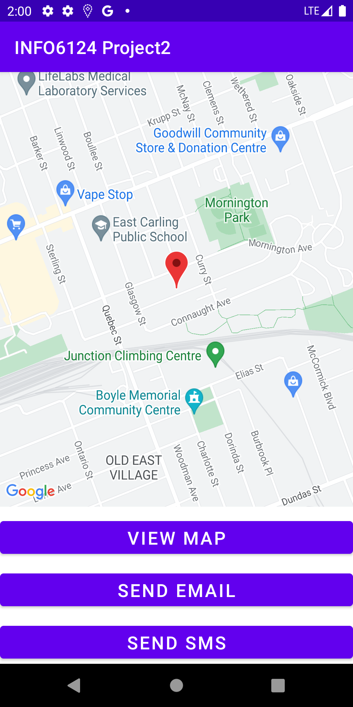
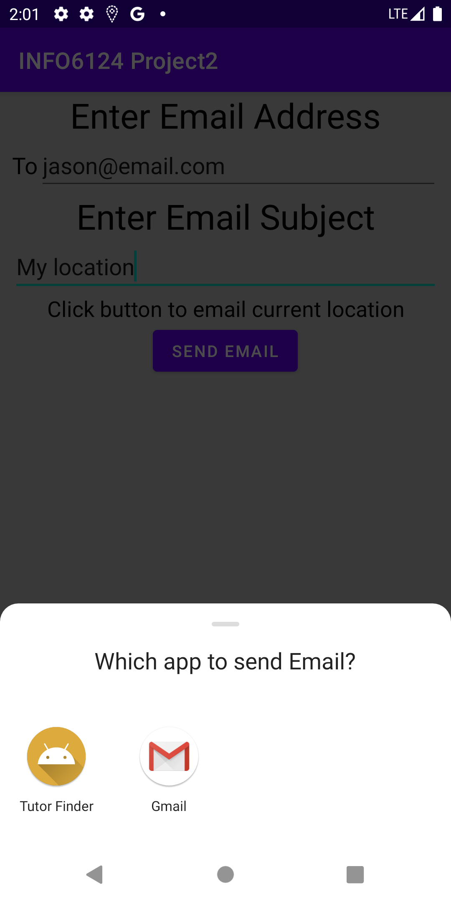
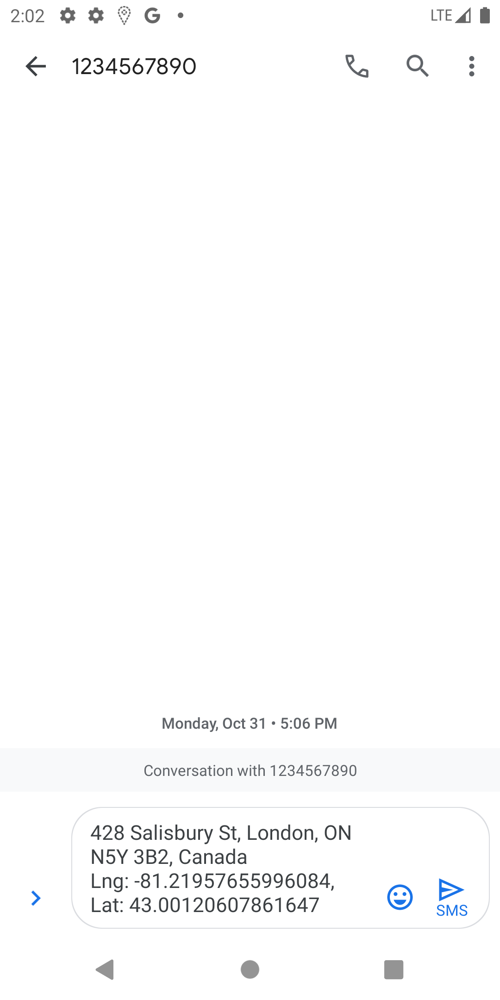

# INFO6124Project2

 <a href="https://kotlinlang.org" target="_blank" rel="noreferrer"> 
 

This app is for sharing locations with email or SMS. It utilizes Google Map API to obtain the user’s current location and shares it by launching email or 
SMS application from the system. 
The email or SMS message is automatically populated with the needed info.

## Tech-Stack

* Google Map API
* Common intent
* Fragments

## Screenshots

  
    
    

