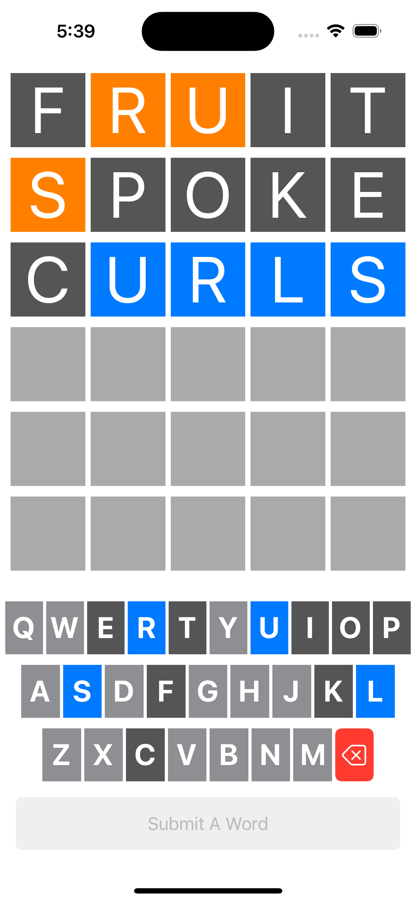
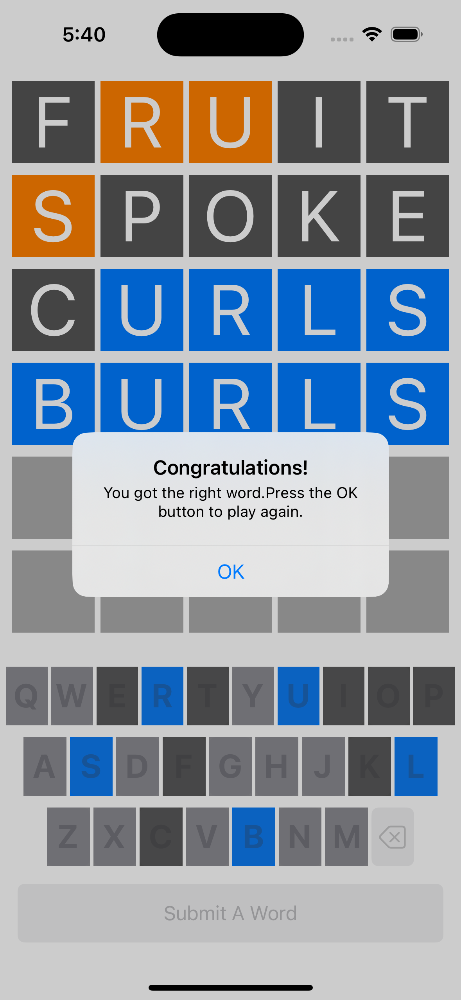
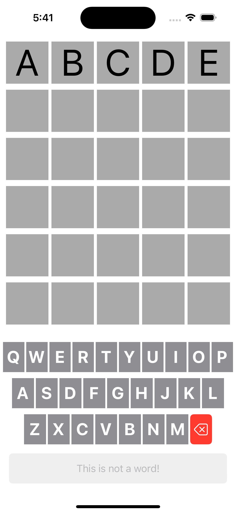

# INFO6125Project1

with Xcode and UIKit

This app is cloning the popular game Wordle. This is my first iOS project, where my problem-solving ability and creativity played a big role in compensating for the very limited iOS development knowledge at that moment.

## Tech-Stack
We only learned the very basics of iOS development, such as array, condition, loop and basic UIKit views when this project is done. Even though the codes do not look pretty, 
the app functions as required after being built with some creativity and problem-solving.

## Screenshots

  
    
    

