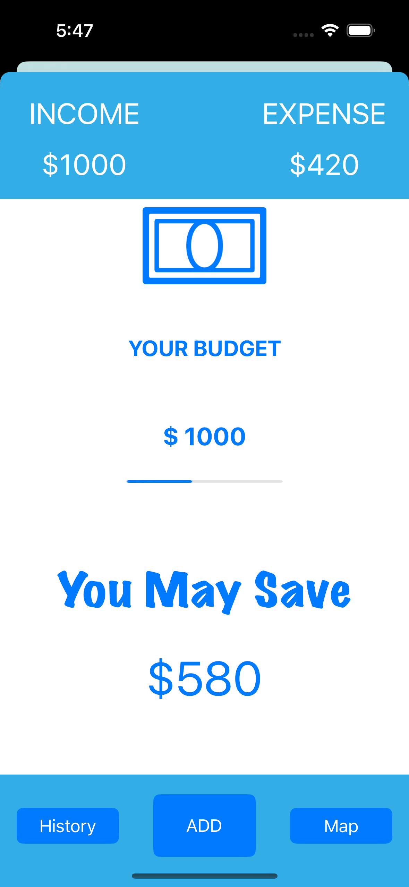
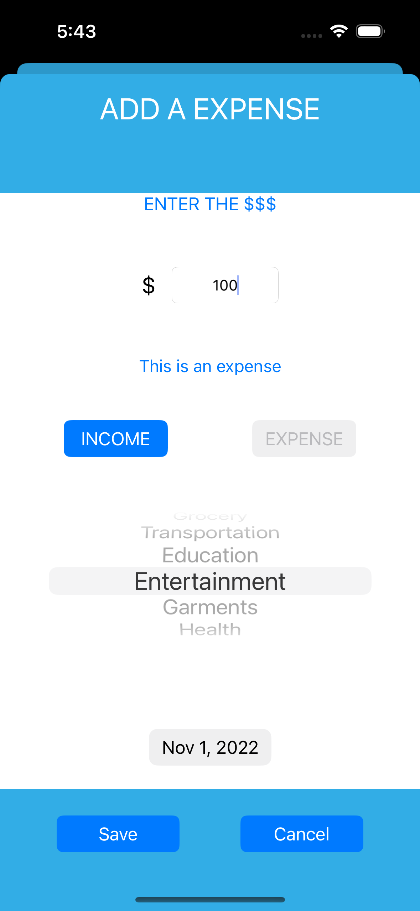
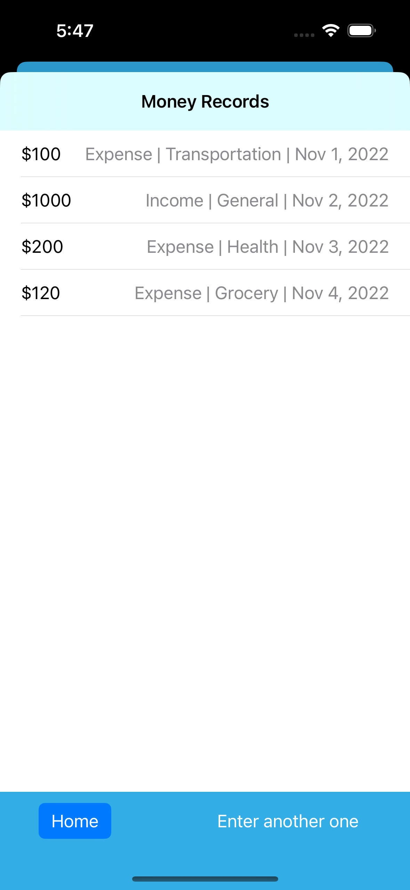
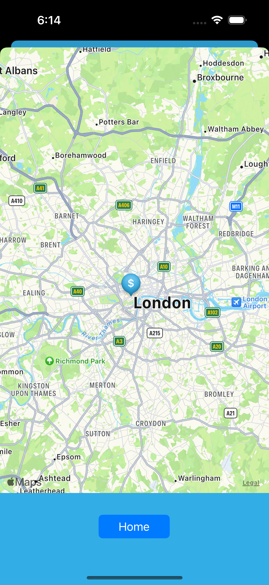

# INFO6125Project2

with Xcode and UIKit

This app is for users to track their expense and income with the event locations logged in a map. Built with a wide range of UI widgets, this app implements its features by utilizing a few key libraries and APIs, e.g. Firebase Authentication, Mapkit, Core Data, and etc.

## Tech-Stack

* Mapkit
* Core Location
* Core Data
* Firebase Authentication
* Data persistance (local)

## Screenshots

  
    
   
   
   

