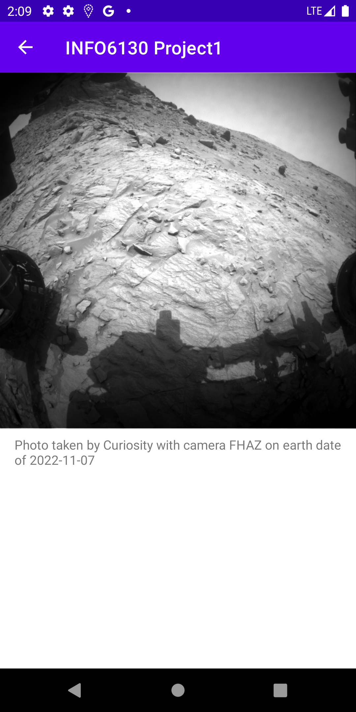

# INFO6130Project1

 <a href="https://kotlinlang.org" target="_blank" rel="noreferrer"> 
 

This app is showcasing the latest Mars images which are obtained from NASA open API with network calls. 
Users can choose from the three Mars Rovers and view their selected ones in the full screen mode. The gallery supports switching between grid and linear layouts.

## Screenshots

  
    
    

