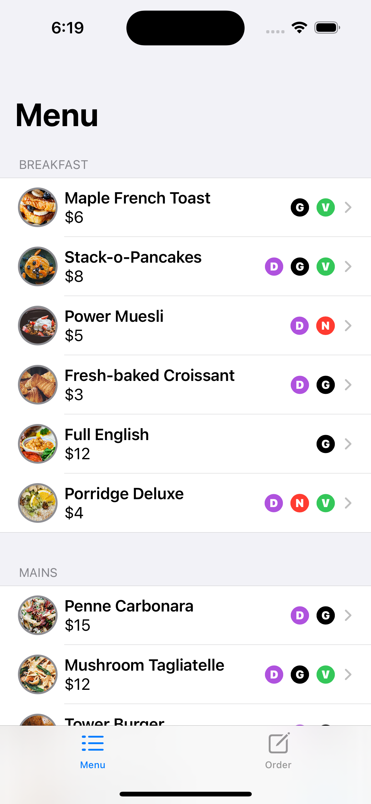
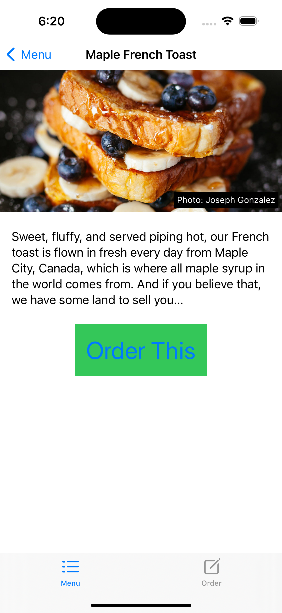
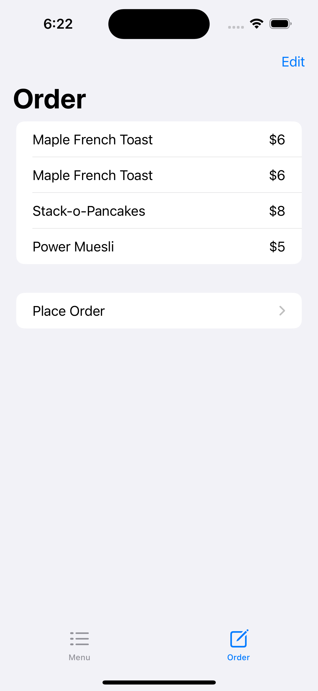
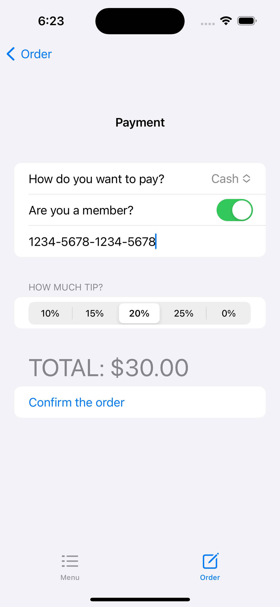

# INFO6131Project1

with Xcode and UIKit

This food ordering app is done as the program was transitioning from UIKit to SwiftUI. It is mainly for practicing the implementation of SwiftUI views, and thus is not expected to be fully functional.

## Tech-Stack
* MVVM
* Various SwiftUI views

## Screenshots

  
    
  
    

