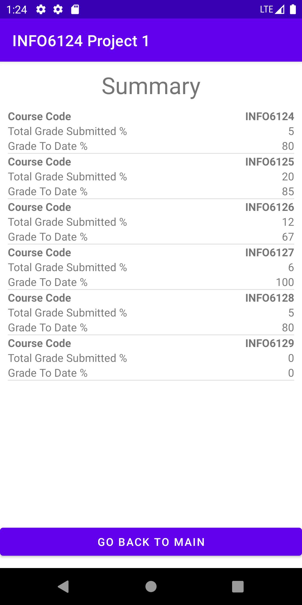
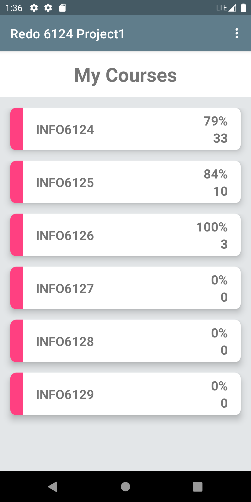
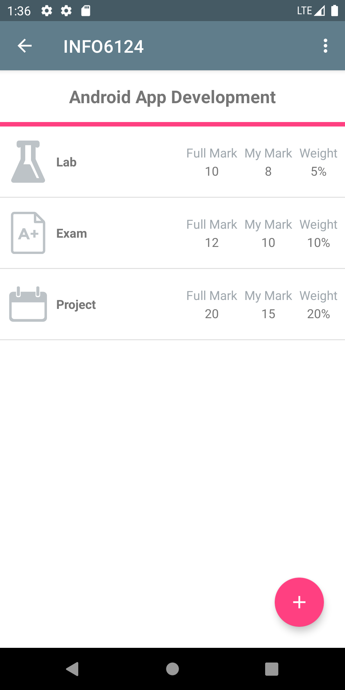
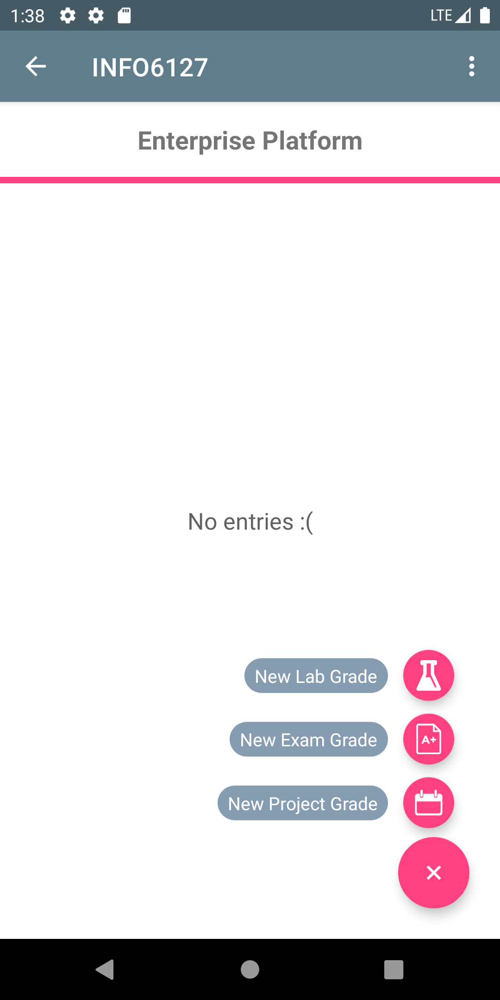

# RedoINFO6124Project1

 <a href="https://kotlinlang.org" target="_blank" rel="noreferrer"> 
 

Redo INFO6124 Project1 with new skills and knowledge

When I started my second semester, I had a desire to redo this app to test the new knowledge and skills I learned afterwards. The redone version delivers the same functions but with greatly optimized UI/UX and improved app architecture.

## Tech-Stack

This redone project is trying to follow the best practice with some afterwards learned techniques. Techniques already applied in the original app are no shown below

* Fragment architecture
* MVVM
* Animation
* Advanced application of recyclerview
* Advanced UI widges

## Screenshots

Old version

  
    
    

Redone version

  
    
    

